# Font Library Usage & Creation

## Built-in Bitmap String Fonts

### 128-Character Bitmap Fonts

128-character bitmap fonts are suitable for displaying the basic ASCII character set. These fonts come in different sizes and styles to suit a variety of display needs.

<table>
  <thead>
    <tr><th>Font File</th><th>Example Image</th></tr>
  </thead>
  <tbody>
    <tr>
      <td>vga1_8x8.py</td>
      <td rowSpan="4"></td>
    </tr>
    <tr><td>vga1_8x16.py</td></tr>
    <tr><td>vga1_16x16.py</td></tr>
    <tr><td>vga1_16x32.py</td></tr>
    <tr>
      <td>vga1_bold_16x16.py</td>
      <td rowSpan="2"></td>
    </tr>
    <tr><td>vga1_bold_16x32.py</td></tr>
  </tbody>
</table>

### 256-Character Bitmap Fonts

256-character bitmap fonts include a wider character set, including some international characters and symbols. These fonts are usually used in more complex application scenarios.

<table>
  <thead>
    <tr><th>Font File</th><th>Example Image</th></tr>
  </thead>
  <tbody>
    <tr>
      <td>vga2_8x8.py</td>
      <td rowSpan="4"></td>
    </tr>
    <tr><td>vga2_8x16.py</td></tr>
    <tr><td>vga2_16x16.py</td></tr>
    <tr><td>vga2_16x32.py</td></tr>
    <tr>
      <td>vga2_bold_16x16.py</td>
      <td rowSpan="2"></td>
    </tr>
    <tr><td>vga2_bold_16x32.py</td></tr>
  </tbody>
</table>

### Usage Example

```python
from lcd import LCD
import vga1_16x32 as font

# Initialize the LCD
lcd = LCD()

# Clear the screen
lcd.fill(LCD.BLACK)
lcd.text(font, "hello", 0, 0, LCD.WHITE, LCD.BLACK)
```

:::info
**Displaying bitmap text:**

+ Call the `lcd.text()` method to display the text "hello" at position (0, 0) on the screen.
+ Set the font color to white (`LCD.WHITE`) and the background color to black (`LCD.BLACK`).
:::

## Built-in Vector String Fonts

### Vector Character Fonts

| Font File | Example Image |
| --- | --- |
| astrol.py | 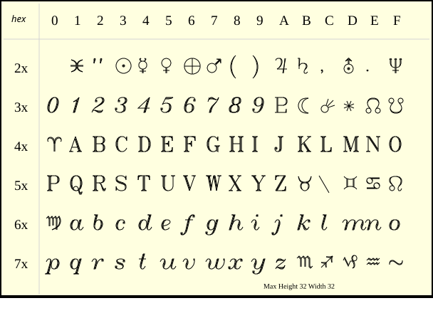 |
| cyrilc.py | 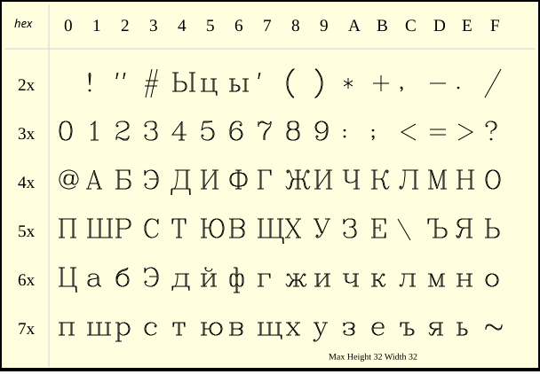 |
| gotheng.py |  |
| gothger.py | 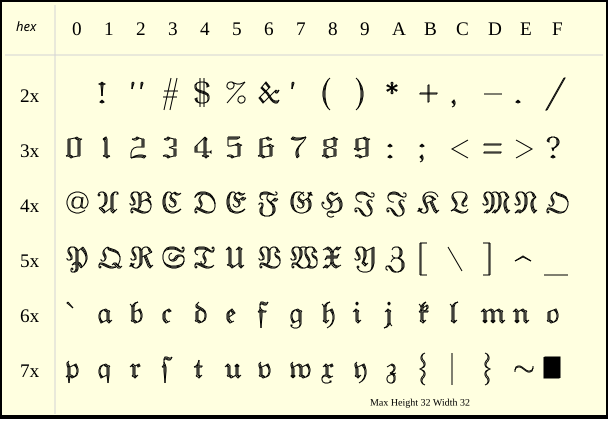 |
| gothita.py | 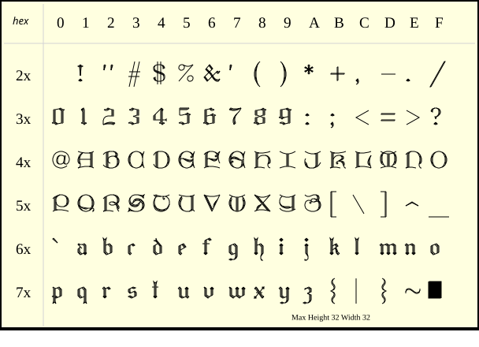 |
| greekc.py |  |
| greekcs.py |  |
| greekp.py | 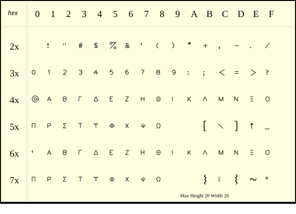 |
| greeks.py |  |
| italicc.py |  |
| italiccs.py |  |
| italict.py |  |
| lowmat.py |  |
| marker.py |  |
| meteo.py | 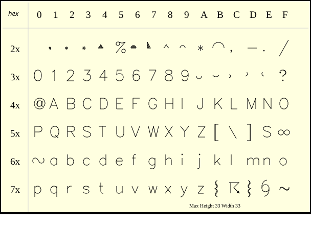 |
| music.py |  |
| romanc.py | 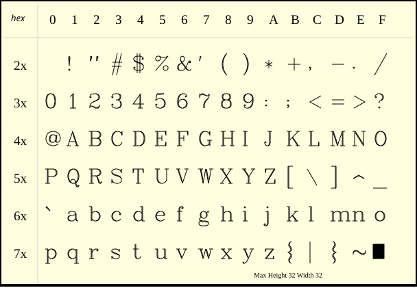 |
| romancs.py |  |
| romand.py |  |
| romanp.py |  |
| romans.py | 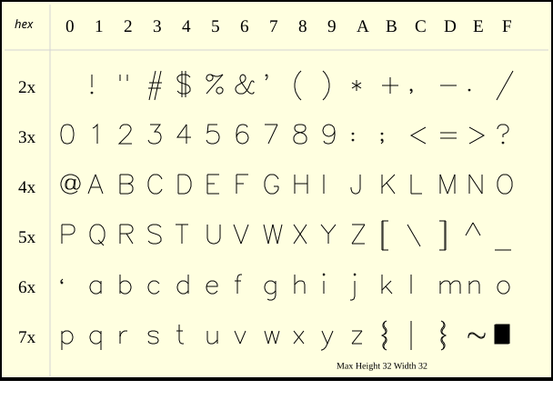 |
| romant.py |  |
| scriptc.py | 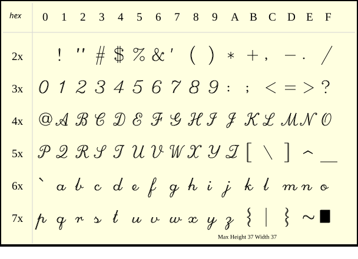 |
| scripts.py |  |
| symbol.py |  |
| uppmat.py | 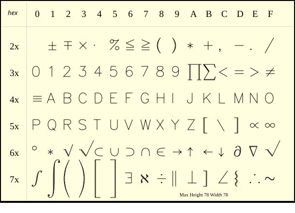 |

### Usage Example

```python
from lcd import LCD
import astrol as font

# Initialize the LCD
lcd = LCD()

# Clear the screen
lcd.fill(LCD.BLACK)
lcd.draw(font, "Hello", 0, 0, LCD.WHITE, scale=1.5)
```

:::info
**Displaying vector text:**

+ Call the `lcd.draw()` method to display the vector font `astrol` text "hello" at position (0, 0) on the screen.
+ Set the font color to white (`LCD.WHITE`) and a 1.5x magnification.
:::

## External Chinese Font Library (User-made)

### Schematic


By running the `font2bitmap.py` program, convert `specified text` into a `bitmap file` of `specified font`, then store the `bitmap file` on the Firefly T1's SD card. You can then use the font library to display Chinese text!

### Creation Steps

1. Download the font-to-bitmap conversion program: [font2bitmap.py](./assets/font2bitmap.py)
2. Download the font file: [NotoSansSC-Regular.zip](./assets/NotoSansSC-Regular.zip) (needs to be unzipped before use)
   - You can use any other font; this is just used as an example.
3. Open a CMD terminal and run `font2bitmap.py`!

Execution process:

1. For example, download the files to `D:\font`

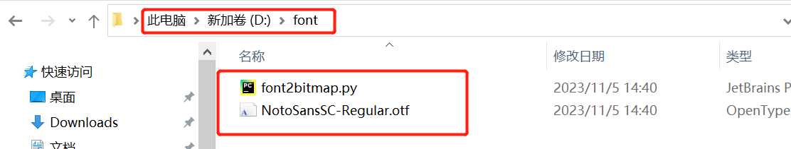

2. Open CMD: press `Win + R`, type `cmd`, then press Enter.


3. Type the command `D:` to enter the D drive (enter whichever drive the files are on).

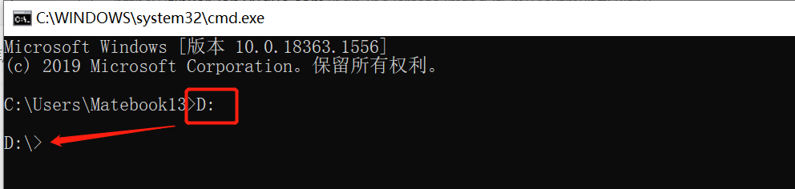

4. Type the command `cd d:\font` to enter the folder.


5. Type the conversion command: `python font2bitmap.py -s "你好" NotoSansSC-Regular.otf 16 > font.py`, then you will get a bitmap library file `font.py` containing the Chinese text "你好".


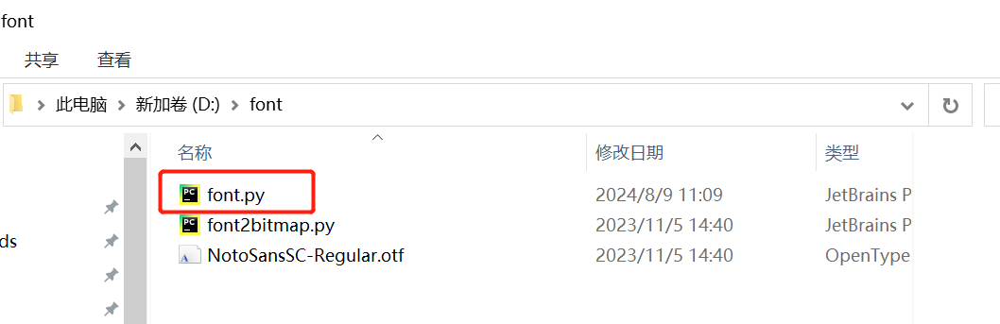

:::warning Note
Before running the command `python font2bitmap.py -s "你好" NotoSansSC-Regular.otf 16 > font.py`, you need to install `python3` and other required tools.
:::

### Usage Example

1. Copy the bitmap file `font.py` to the Firefly T1's `\SD\sys\font` directory
2. Then import the `font` module (note that you must add the environment variable path first)

```python
import sys
sys.path.append('/sd/sys/font')

import font as font
```

3. Use the `write(bitmap_font, s, x, y[, fg, bg, background_tuple, fill_flag])` method to display the text.

```python
import sys
sys.path.append('/sd/sys/font')
import font as font

from lcd import LCD
# Create an LCD instance
display = LCD()

# Clear the screen to black
display.fill(LCD.BLACK)

display.write(font,"你好",0,0,LCD.WHITE)
```