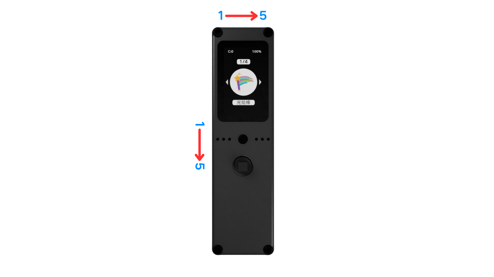

# Expansion Interface

This article introduces the basic information and detailed usage of the 5P-PIN expansion interfaces (top) and (side).

## Hardware Overview

The Firefly T1 has two expansion interfaces: one 5-PIN interface (top) and another 5-PIN interface (left).

### 5P-PIN (Top)

| Pin | Function | Control Port |
|-----|----------|--------------|
| PIN1 | VCC output (5V) | GPIO43 (high-impedance off, low-level on) |
| PIN2 | GPIO | GPIO14 |
| PIN3 | GND | Direct GND |
| PIN4 | - | - |
| PIN5 | GPIO | GPIO13 |

**Notes:**

- PIN1 is an output port controlled by a P-MOS transistor. It only conducts and outputs VCC when GPIO43 is pulled high (set to high-impedance).
- PIN3 & PIN4 are connected together as one port to increase the current-carrying capacity of the contact.
- PIN2 & PIN5 are GPIO pins directly connected to the MCU, mainly used for outputting control signals.

**Important:**

- When powered by battery, you must actively turn on "VCC output" through power management (pm) to get 5V output.
- The display side is the "front". The 5P-PIN order is read "from left to right" on the front.

### 5P-PIN (Left)

| Pin | Function | Control Port |
|-----|----------|--------------|
| PIN1 | VCC output (5V) | GPIO43 (high-impedance off, low-level on) |
| PIN2 | GND | Direct GND |
| PIN3 | GPIO | GPIO42 |
| PIN4 | GPIO | GPIO15 |
| PIN5 | GPIO | GPIO16 |

**Notes:**

- PIN1 is an output port controlled by a P-MOS transistor. It only conducts and outputs VCC when GPIO43 is pulled high (set to high-impedance).
- PIN3-PIN5 are GPIO pins directly connected to the MCU, mainly used for outputting control signals.

**Important:**

- When powered by battery, you must actively turn on "VCC output" through power management (pm) to get 5V output.
- The display side is the "front". The 5P-PIN order is read "from top to bottom" on the front.

## Usage

### Top 5-PIN

The 5-PIN top interface is mainly used to drive light-type devices, such as controlling WS2812-type color LEDs combined with the neopixel library. It can also be used for high-power dimming control through a P-MOS transistor.

### Side 5-PIN

The side 5-PIN interface is mainly used to connect peripherals. You can connect external devices via I2C, SPI, UART, etc., and it also provides power output. Of course, it can also drive low-power color LEDs.

## Usage Examples

### Color LEDs (neopixel)

Combined with the neopixel library, connect WS2812-type color LEDs through the top 5-PIN interface to easily implement light control.