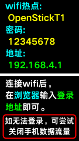

# Connect to Phone & PC

Beetle S1 supports two ways to connect: **wireless hotspot** (for settings and asset management) and **wired USB drive** (for file read/write and light effect updates). Choose whichever fits your needs.

## Wireless Connection

No data cable needed — use the Wi-Fi hotspot built into Beetle S1 and open the management page from your phone or computer's browser.

### Step 1: Enter "Hotspot"

On the main screen, select and enter the "**Hotspot**" feature.

### Step 2: Connect to the Wi-Fi Hotspot

After entering, the screen shows the Wi-Fi hotspot name and password. Connect your phone or computer to that hotspot.

### Step 3: Open the Management Page

Once connected, open your browser and enter the address shown on the screen, `192.168.4.1`, to connect to Beetle S1.

### Step 4: Manage Settings & Assets

The page includes test settings and lets you manage the image assets used in the light painting app. Here you can adjust various parameters on Beetle S1, as well as add or delete assets.

## Wired Connection

Use the included Type-C data cable to connect Beetle S1 to a USB port on your computer for file read/write and light effect updates.

### How to Connect

Connect Beetle S1 to your computer with the Type-C data cable.

### USB Drive Function

Once connected successfully, a new USB drive will appear in your computer's file explorer, which you can use like a normal USB drive.

Operations you can do directly on the USB drive include:
- Copy new light effect programs to the USB drive
- Manage image assets
- Update system files, and more

## Notes

### About Data Cable

- To ensure charging power and data transmission stability, it is recommended to use the original matching data cable
