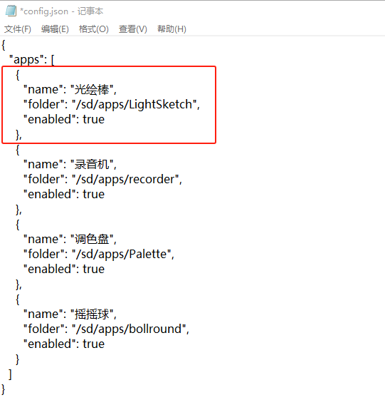

import Link from '@docusaurus/Link';

# App Installation

The official app library is continuously updated with new and fun apps, helping you expand the capabilities of Firefly T1. It's designed for photography enthusiasts and players — no programming required, just download a ready-made app and get started.

## App Library

The app library is an online spreadsheet with various light apps for Firefly T1. Visit the [Firefly T1 App Library](https://socolode.yuque.com/ogwgwg/xnlyru/ktn7g8bbx5d6wln6) to browse the full list and download links.

## Installing Apps

### 1. Download an App

Open the app library, choose a light app and download it.

### 2. Connect to Computer

Connect Firefly T1 to your computer using a USB cable. After a few seconds, a new USB drive will appear.

### 3. Add the App

1. Drag the downloaded app file into the `/apps` folder on the USB drive

### 4. Register the App

1. Open `apps/config.json` on the USB drive with a text editor

2. Add the new app information to `config.json`

Each app entry includes:
- `"name"`: App name
- `"folder"`: App folder path
- `"enabled"`: Whether the app is enabled

:::note
- The `config.json` file must be updated for the app to appear on the device
- The order of entries determines the display order
:::

### 5. Launch the App

After successful configuration, power on the Firefly T1, navigate with the joystick, and press the center button to launch your new app!