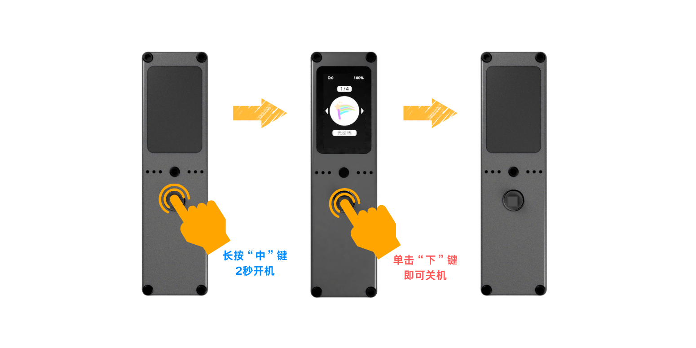
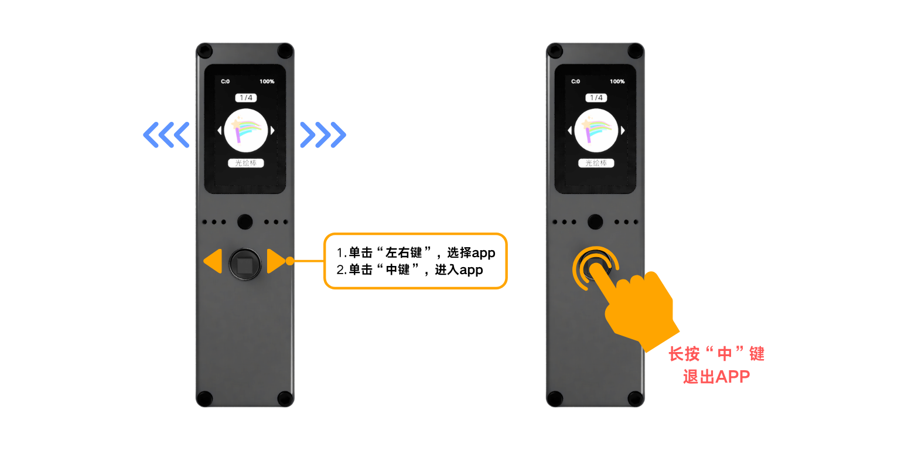

import Link from '@docusaurus/Link';

# Unboxing & Basic Operations

## Hardware Diagram

:::caution
Incorrect battery polarity will prevent the device from powering on.
:::

## Basic Operations

### Power On & Off

**Power On**
1. With the device off
2. Press and hold the joystick center button for 2 seconds

**Power Off**
1. Exit all apps and return to the home screen
2. Press the joystick down button once

### Enter & Exit Apps

**Enter App**
1. Move the joystick left/right to select an app
2. Press the center button to enter

**Exit App**
1. While in an app
2. Press and hold the center button for 2 seconds to return to home

### Get More Apps

<Link to="../app-development/first-script">App Development Guide →</Link>

## Charging

5V input via Type-C port. Connect the included Type-C cable to a charger or computer.

## Charging Notes

- You can use a phone charger or power bank to charge the device
- The device can be stored directly after power off, no need to remove the battery
- After plugging in the power, it automatically switches to external power supply; the device can work normally even without a battery installed