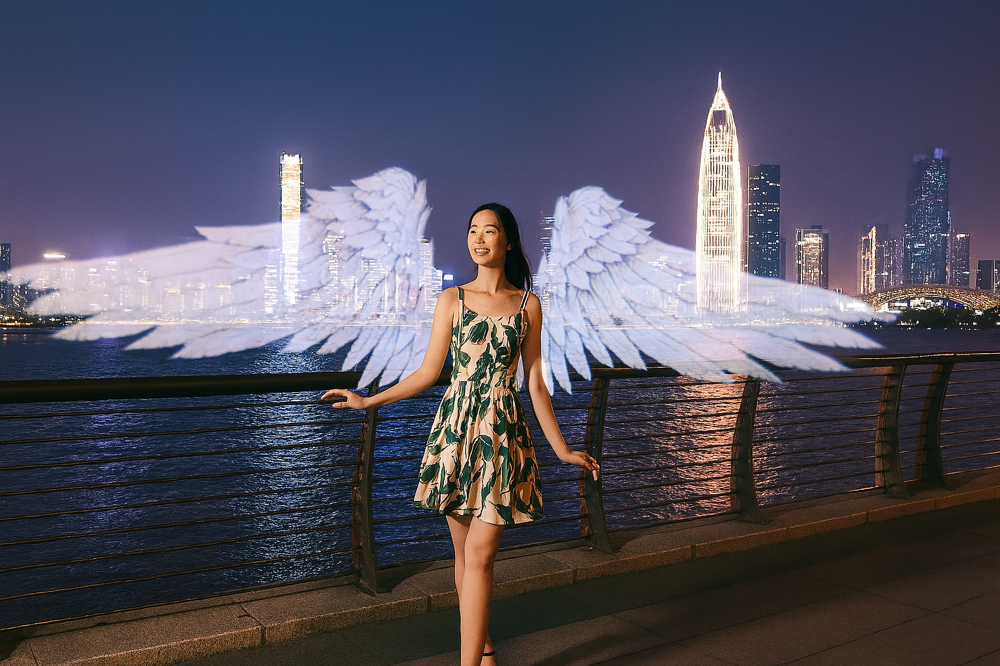
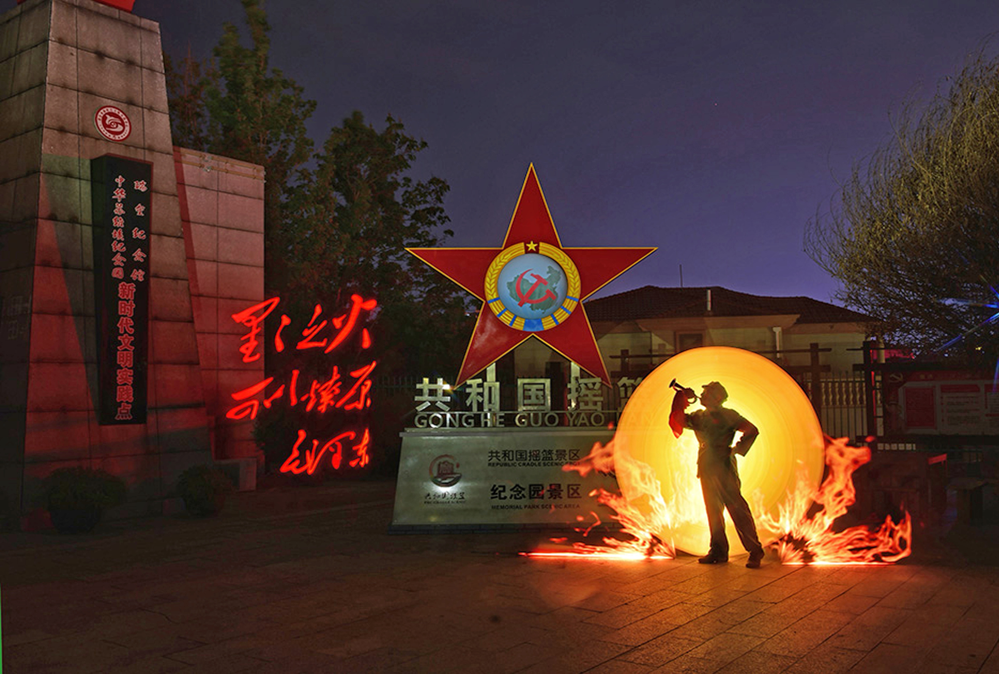
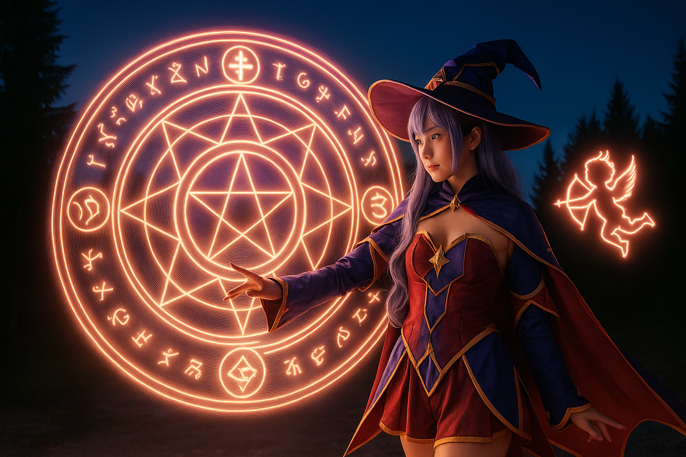

<head>
  
</head>

# Light Painting Techniques Collection

The Light Painting Techniques Collection is a curated library of creative inspiration and techniques from Socolode, featuring dozens of light painting creative styles. Each technique library comes with detailed shooting parameters, technique guides, and light painting materials to help you get started quickly and recreate the effects easily.

## Inspiration Library

Here you can browse a wide collection of outstanding light painting works to spark your creativity (continuously updated)

[View Creative Inspiration Collection →](./creative-inspiration.mdx)

## Technique Library

Each technique library includes detailed shooting parameters, technique explanations, and light painting materials to help you quickly master and recreate the effects.

  
  
<strong>Wings Library</strong>

  
  
<strong>Cars Library</strong>

  
  
<strong>Red Library</strong>

  
  
<strong>Scenic Spots Library</strong>

  
  
<strong>Magic Circle Library</strong>

  
  
<strong>Festival Library</strong>

  
  
<strong>Text Library</strong>

  
  
<strong>Drone Library</strong>

  
  
<strong>Canvas Library</strong>

:::info
If you have amazing works to share, feel free to contact us to upload and share your creations. Let more people see your creativity, exchange ideas, and grow together!
:::

## Community

Join the light painting community to exchange creative ideas with fellow enthusiasts:

