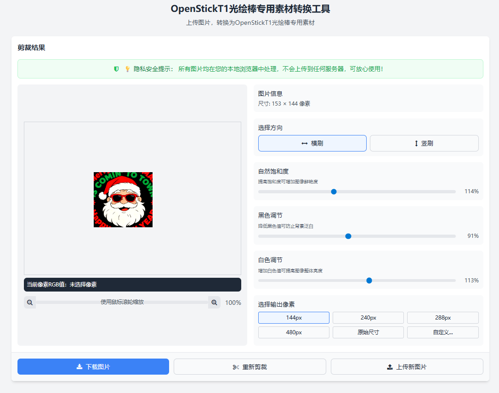
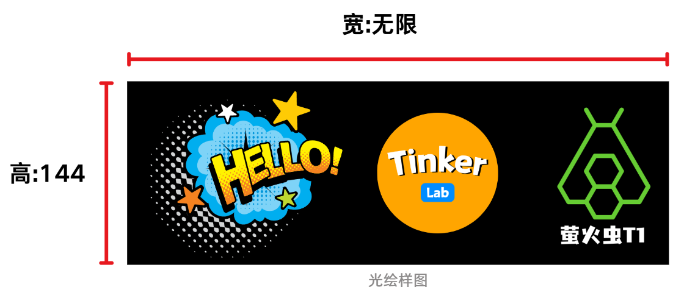
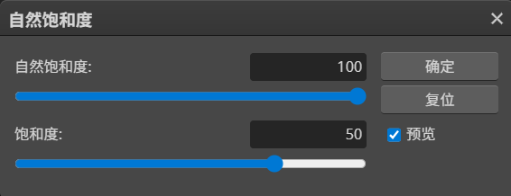
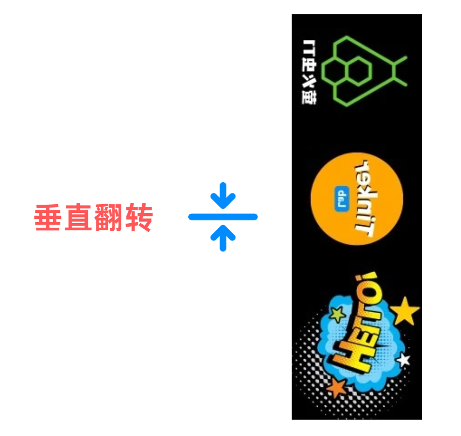
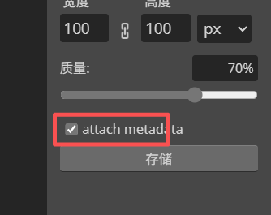
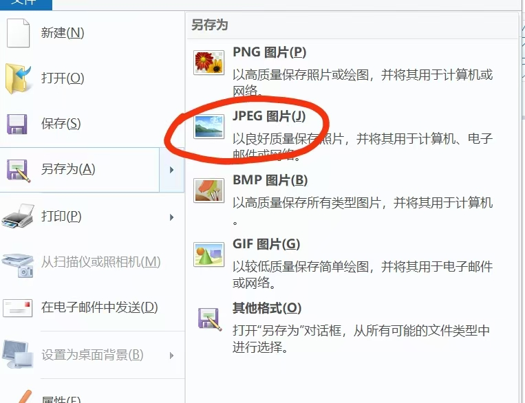

# OpenStick T1 Material Creation - Make Your Own Light Painting Patterns

## Introduction

Before creating your own light painting images, let me briefly explain the principle of how the light painting wand plays images, to help you better understand the image creation process.

Due to the limited performance of the Firefly T1, image detail processing needs to be pre-processed on a computer before being uploaded to the Firefly T1 for playback.

The image playback process is frame-by-frame from bottom to top. Therefore, when pre-processing images, rotation and flipping operations are required.

---

## New Method (Automatic)

### Online Processing Tool

[Open Online Tool →](../online-tool.mdx)

### Key Parameters

| Parameter | Description |
|-----------|-------------|
| **Horizontal/Vertical Brush** | Choose based on your actual drawing needs. Suitable for different creative scenarios to achieve the best results. |
| **Natural Saturation** | Adjust according to personal preference. Higher values result in more vivid and bright light painting colors. |
| **Black Adjustment** | Reduce the black value to purify the background, making black areas in the image pure black (RGB value 0,0,0). You can verify this by hovering over the black background and checking if the "Current Pixel RGB Value" is (0,0,0). |
| **White Adjustment** | Increasing the white value makes the overall image brighter, making light painting lines more visible. |
| **Output Pixels** | This setting is linked to the wand length. For example: 1-meter 3-segment wand selects 144; 1.65-meter 5-segment wand selects 240; 1-segment wand has 48 LEDs, etc. |

---

## Old Method (Manual)

### 1. Creating Light Painting Images

#### 1.1 Image Size

Because the light painting wand has 144 LED beads, the image pixel requirement is: **144 × N** (Height: fixed at 144, Width: unlimited).

#### 1.2 Image Adjustment

##### Black Background

The LED beads display "black" by not emitting light, so areas that don't need to be displayed should be set to black, such as the background.

##### Color Adjustment

Since the color effect of light painting is generally "lighter" than what's displayed on screen, you need to pre-increase the "saturation" of the image to make the light painting colors more faithful to the original material.

##### 90° Right Rotation

The light painting wand's program plays images from bottom to top, frame by frame. So the image needs a 90° right rotation.

##### Mirror Image

Since light painting photos are "mirrored", if you want the text in your light painting to appear normal, you need to vertically flip the image!

#### 1.3 Image Format

Export configuration must follow these requirements, otherwise it won't play:

- **Name requirement**: Numbers or characters (Chinese not supported)
- **Save type**: 24-bit bitmap (*.bmp)

#### 1.4 Preview Image

To make it easier to see the image preview when selecting images in the light painting app, we need to create a scaled-down image with a resolution of 100×100!

Export configuration:
- **Name**: Same as the main image
- **Pixels**: 100×100
- **Format**: *.jpg

Now you have two images:

| Main Image | Preview Image |
|------------|---------------|
| xxx.bmp (144×N) | xxx.jpg (100×100) |

---

## Uploading Light Painting Images

After creating the main image and preview image, you need to upload them to the designated location on the Firefly T1's SD card: `/sd/image`, before you can play the images.

For detailed download and import steps, please see: [Material Download Tutorial](./material-download.mdx) 📥

---

## PS Operation Videos

The PS version in this video is the online version of PS, which may differ slightly from the latest desktop version of PS, but the operation logic is the same.

PS website: [https://ps.pic.net/](https://ps.pic.net/)

### 3.1 Pre-processing

Before creating light painting image files, you can perform basic "pre-processing" on the original image:

- **Purify background** (prevents light painted images from having white backgrounds)
- **Increase saturation** (makes light painting colors more vivid and bright)

:::note
PS pre-processing video placeholder (to be added)
:::

### 3.2 Export Light Painting Material Files

Take the pre-processed image, adjust pixels, rotate direction, etc., to export image files that the light painting wand can recognize and use.

:::note
PS export video placeholder (to be added)
:::

---

## Notes

- Image names **do not support Chinese characters**
- jpg pixel (resolution) must be **100×100**

---

## Common Issues

### After importing the image, it shows "jpg error"

This means the preview image format is incorrect. You need to check "attach metadata" when exporting.

If that doesn't work, you can directly use the built-in "Paint" tool to save as jpg format.

---

## Final Example

---

## Contact Support

If you have any questions, feel free to contact me anytime.

**Personal WeChat**: agui-lab

<head>
  
</head>
