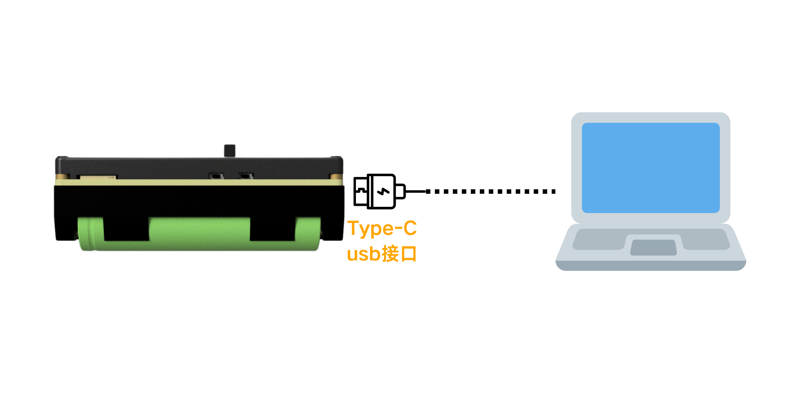
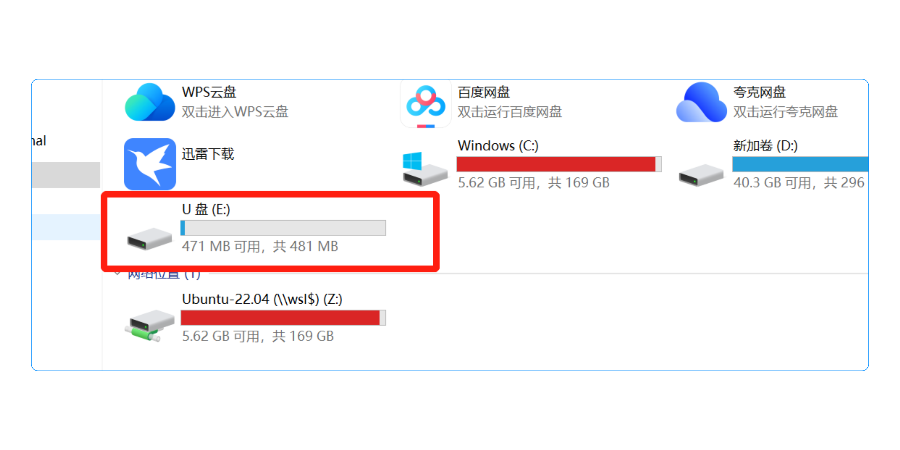
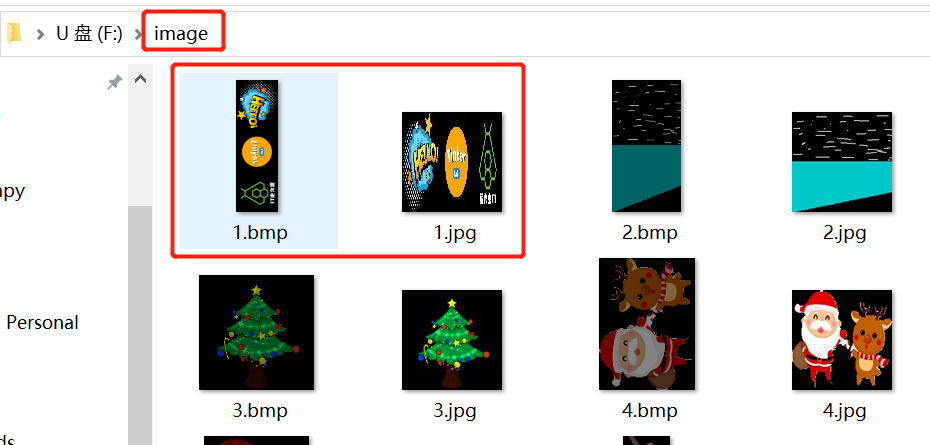

import Link from '@docusaurus/Link';

# Material Download

After creating your light painting materials, you need to import them into the wand device before use. This tutorial shows how to connect to a computer via USB and upload material images to the Firefly T1.

---

## 1. Connect to Computer

Connect the Firefly T1 to your computer using a USB cable, then wait for the computer to detect a new USB drive.

**Connection method:**

**USB drive detected by computer:**

---

## 2. Import Material Images

### 1️⃣ Open the image folder

Open the USB drive and navigate to the `image` folder (create it manually if it doesn't exist).

### 2️⃣ Copy material images

Copy your finished **main image (BMP)** and **preview image (JPG)** into the `image` folder to complete the upload.

:::tip File naming
We recommend renaming material files with numbers or English characters (e.g., `001.bmp`, `001.jpg`). Avoid Chinese filenames, which the device may not recognize.
:::

---

## 3. Play Materials After Import

Once images are uploaded, open the light painting wand app on the Firefly T1 and select the imported images to start creating! 🎉

:::note Material creation
If you haven't created materials yet, please refer to the <Link to="./material-creation" style={{color: '#2563eb', textDecoration: 'underline'}}>Material Creation</Link> tutorial to learn how to make light painting images with the online tool or Photoshop.
:::

<head>
  
</head>
