# 字库应用与制作

## 内置位图字符串字库

### 128 字符位图字体

128 字符位图字体适用于显示基本的 ASCII 字符集。这些字体具有不同的尺寸和样式，适合多种显示需求。

<table>
  <thead>
    <tr><th>字体文件</th><th>示例图片</th></tr>
  </thead>
  <tbody>
    <tr>
      <td>vga1_8x8.py</td>
      <td rowSpan="4"></td>
    </tr>
    <tr><td>vga1_8x16.py</td></tr>
    <tr><td>vga1_16x16.py</td></tr>
    <tr><td>vga1_16x32.py</td></tr>
    <tr>
      <td>vga1_bold_16x16.py</td>
      <td rowSpan="2"></td>
    </tr>
    <tr><td>vga1_bold_16x32.py</td></tr>
  </tbody>
</table>

### 256 字符位图字体

256 字符位图字体包含了更广泛的字符集，包括一些国际字符和符号。这些字体通常用于更复杂的应用场景。

<table>
  <thead>
    <tr><th>字体文件</th><th>示例图片</th></tr>
  </thead>
  <tbody>
    <tr>
      <td>vga2_8x8.py</td>
      <td rowSpan="4"></td>
    </tr>
    <tr><td>vga2_8x16.py</td></tr>
    <tr><td>vga2_16x16.py</td></tr>
    <tr><td>vga2_16x32.py</td></tr>
    <tr>
      <td>vga2_bold_16x16.py</td>
      <td rowSpan="2"></td>
    </tr>
    <tr><td>vga2_bold_16x32.py</td></tr>
  </tbody>
</table>

### 应用示例

```python
from lcd import LCD
import vga1_16x32 as font

# 初始化 LCD
lcd = LCD()

# 清屏
lcd.fill(LCD.BLACK)
lcd.text(font, "hello", 0, 0, LCD.WHITE, LCD.BLACK)
```

:::info
**显示位图文本：**

+ 调用 `lcd.text()` 方法，在屏幕上指定位置 (0, 0) 显示文本 "hello"。
+ 设置字体颜色为白色 (`LCD.WHITE`) 和背景颜色为黑色 (`LCD.BLACK`)。
:::

## 内置矢量字符串字库

### 矢量字符字体

| 字体文件 | 示例图片 |
| --- | --- |
| astrol.py |  |
| cyrilc.py |  |
| gotheng.py | 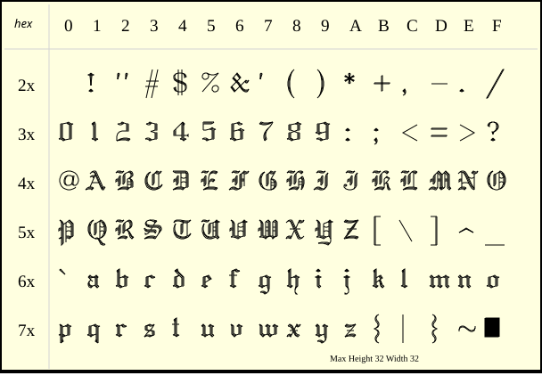 |
| gothger.py |  |
| gothita.py |  |
| greekc.py | 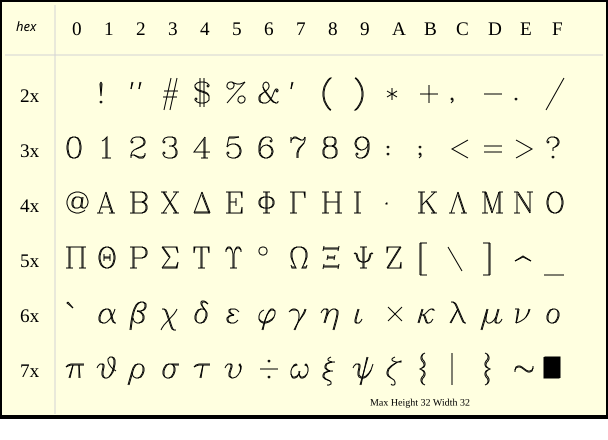 |
| greekcs.py | 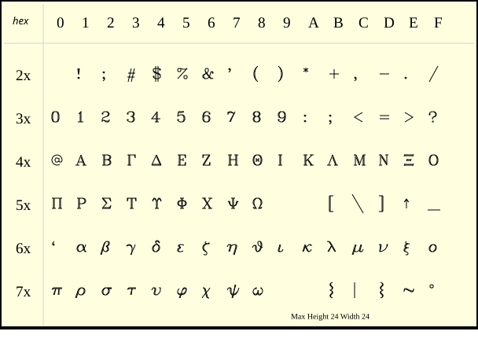 |
| greekp.py |  |
| greeks.py | 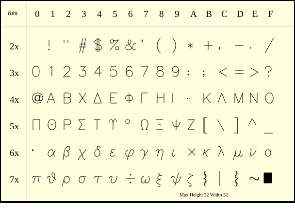 |
| italicc.py | 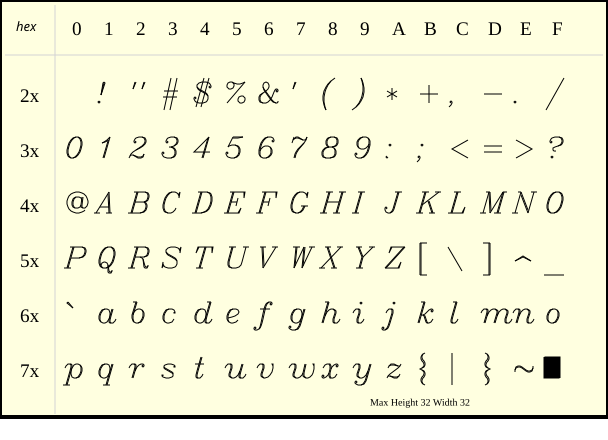 |
| italiccs.py | 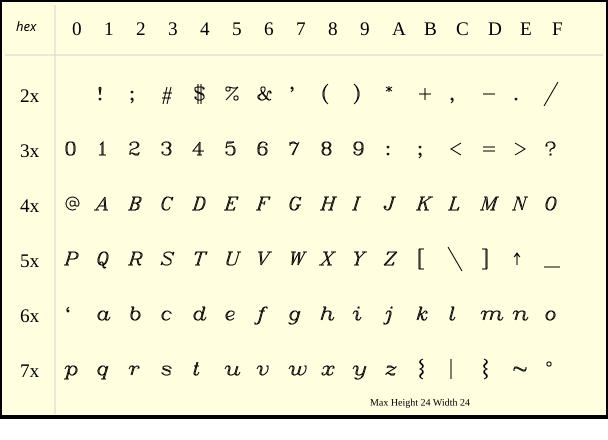 |
| italict.py | 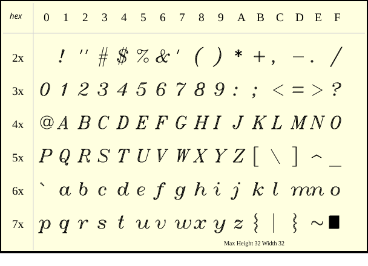 |
| lowmat.py | 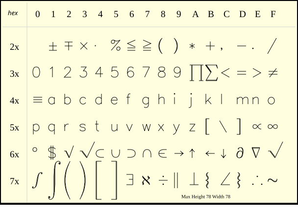 |
| marker.py | 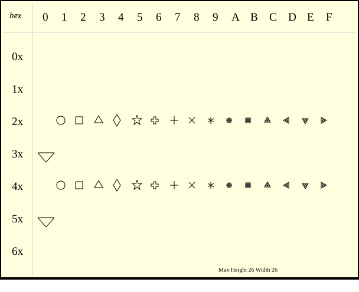 |
| meteo.py |  |
| music.py | 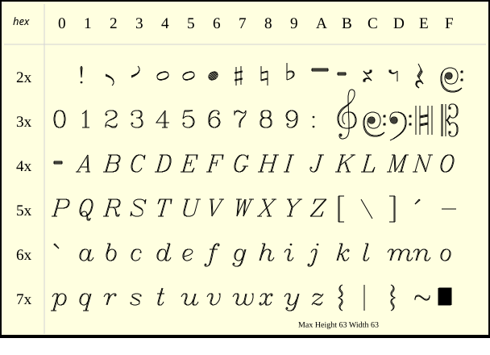 |
| romanc.py |  |
| romancs.py | 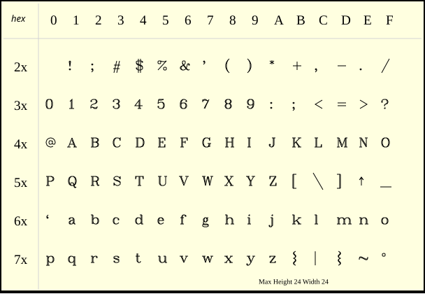 |
| romand.py | 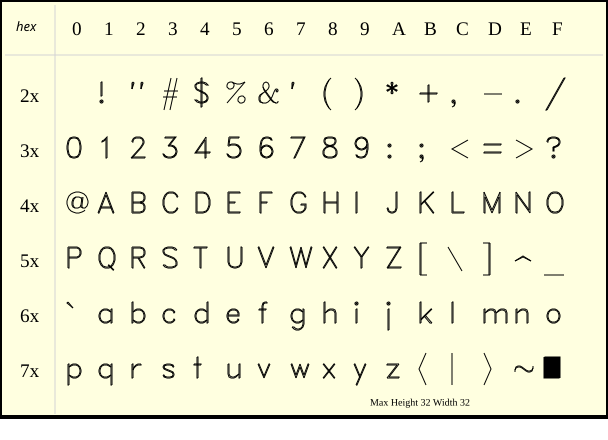 |
| romanp.py | 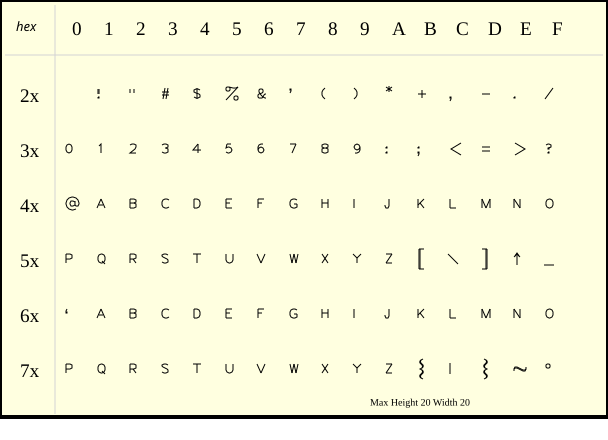 |
| romans.py |  |
| romant.py | 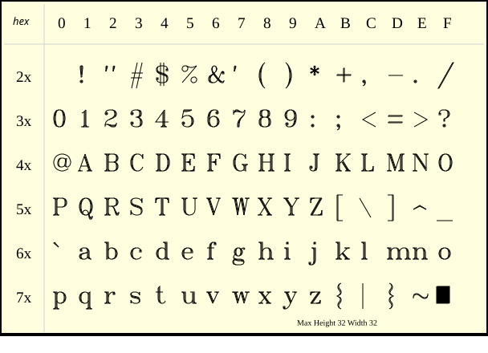 |
| scriptc.py |  |
| scripts.py | 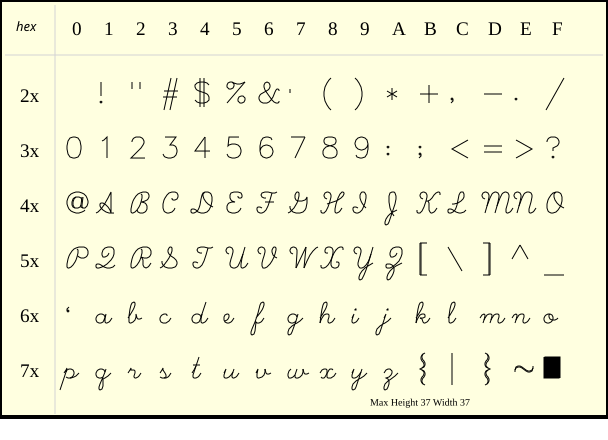 |
| symbol.py | 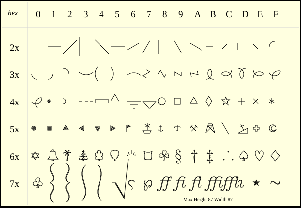 |
| uppmat.py |  |

### 应用示例

```python
from lcd import LCD
import astrol as font

# 初始化 LCD
lcd = LCD()

# 清屏
lcd.fill(LCD.BLACK)
lcd.draw(font, "Hello", 0, 0, LCD.WHITE, scale=1.5)
```

:::info
**显示矢量文本：**

+ 调用 `lcd.draw()` 方法，在屏幕上指定位置 (0, 0) 显示矢量字体 `astrol` "hello"。
+ 设置字体颜色为白色 (`LCD.WHITE`) 和 1.5 倍的放大倍数。
:::

## 外置中文字库（需自制）

### 原理图


通过执行 `font2bitmap.py` 程序，将`指定文字`转换成`指定字体`的`位图文件`，然后把`位图文件`存放到萤火虫T1的 sd 卡里，即可调用字体库，显示中文字体！

### 制作步骤

1. 下载字体转位图程序：[font2bitmap.py](./assets/font2bitmap.py)
2. 下载字体文件：[NotoSansSC-Regular.zip](./assets/NotoSansSC-Regular.zip)（需要解压缩使用）
   - 字体文件可以使用任何其他字体，这个只是用来作为例子使用。
3. 打开 CMD 终端，执行 `font2bitmap.py`，即可！

执行过程：

1. 譬如，把文件下载到 `D:\font`


2. 打开 CMD：按 `Win + R`，输入 `cmd`，然后按回车键。

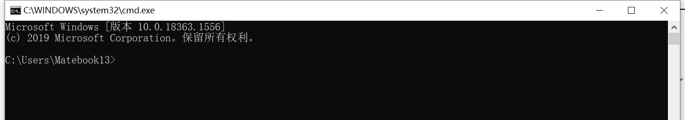

3. 输入命令 `D:` 命令进入 D 盘（文件是放在什么盘就进入什么盘）。


4. 输入命令 `cd d:\font` 进入文件夹。

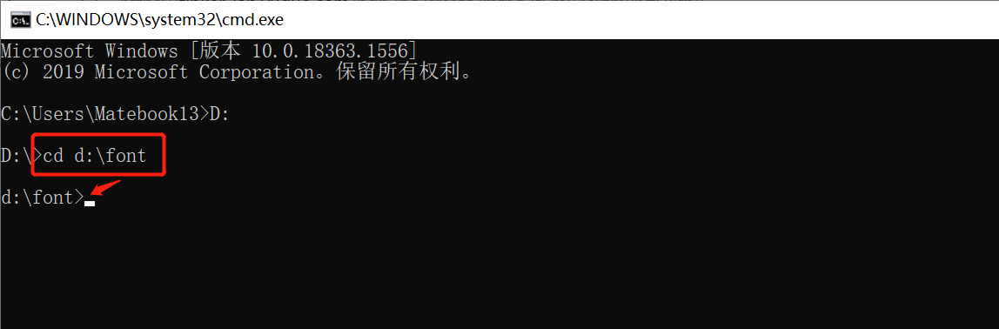

5. 输入转换命令：`python font2bitmap.py -s "你好" NotoSansSC-Regular.otf 16 > font.py`，即可获得包含 "你好" 中文的位图库文件 `font.py`。

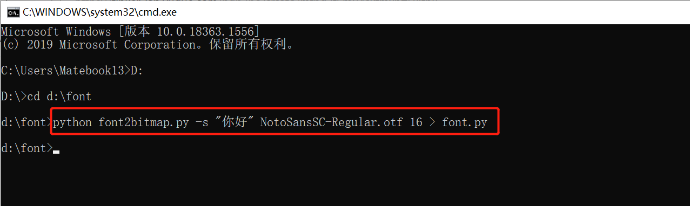


:::warning 注意
在执行 `python font2bitmap.py -s "你好" NotoSansSC-Regular.otf 16 > font.py` 命令之前，需要按照 `python3` 以及其他需要安装的工具。
:::

### 应用示例

1. 把位图文件 `font.py` 复制到萤火虫T1的 `\SD\sys\font` 里面
2. 然后导入 `font` 模块（注意，要先导入环境变量路径）

```python
import sys
sys.path.append('/sd/sys/font')

import font as font
```

3. 使用 `write(bitmap_font, s, x, y[, fg, bg, background_tuple, fill_flag])` 方法把文字显示出来。

```python
import sys
sys.path.append('/sd/sys/font')
import font as font

from lcd import LCD
# 创建 LCD 实例
display = LCD()

# 清除屏幕为黑色
display.fill(LCD.BLACK)

display.write(font,"你好",0,0,LCD.WHITE)
```