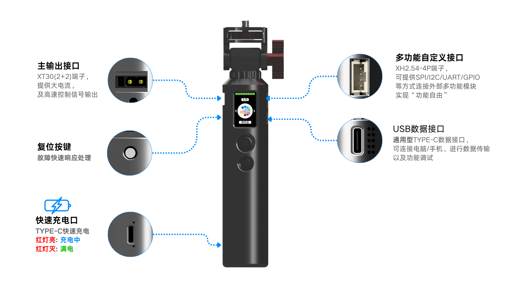
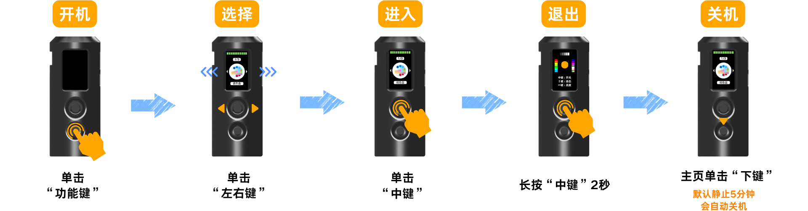

# 基础操作

## 接口一览

独角仙S1 的机身接口分布：

| 接口 | 说明 |
|------|------|
| XT30(2+2) 端子 | 主输出，大电流 + 高速控制信号，用于连接灯带 |
| 快充口（Type-C） | 充电用，红灯充电中，灭灯已充满 |
| 数据口（Type-C） | 连接电脑或手机进行调试和文件传输 |
| 4PIN 多功能接口（XH2.54-4P） | SPI/I2C/UART/GPIO 扩展 |
| 复位按键 | 故障时快速重启 |

## 充电

使用附带的充电用 Type-C 数据线连接充电器，即可充电。

- 充电时快充口旁有红色指示灯，充满后熄灭
- 使用 5V/2A 以上充电器，充电速度更快
- 可使用手机充电器或充电宝进行充电

## 开机 & 关机

**开机**
1. 关机状态下
2. 单击功能键即可开机

**关机**
1. 退出所有灯光应用回到"主页"状态下
2. 单击"下键"，即可关机

:::tip
S1 默认静止 5 分钟自动关机，省电又省心。
:::

**进入应用**
1. 拨动"左右键"，选择想要的应用
2. 单击"中键"，进入应用

**退出应用**
1. 在灯光应用界面的状态下
2. 长按"中键"2秒，退出应用回到"主页"

## 按键操作指南

S1 的按键布局和 T1 不同，请熟悉以下按键功能：

| 按键 | 功能 |
|------|------|
| 功能键 | 特殊功能/菜单快捷入口 |
| 左右键 | 拨动选择应用/调整参数 |
| 中键 | 单击进入应用/确认，长按2秒退出应用 |
| 下键 | 单击关机/返回 |

## 注意事项

### 充电方式

- 采用 Type-C 快充接口，可搭配手机充电器、充电宝充电
- 支持边充电边使用；红灯亮起为充电中，灯灭代表电量已满

### 数据线

- 建议使用原装配套线材，保障充电功率与数据传输稳定

### 使用注意

- 整机无防水功能，切勿沾水、在潮湿环境使用
- 机身外壳为 3D 打印材质，易破损，避免摔落、磕碰与重压
- 请勿自行拆解、改装设备内部电路

### 存放说明

- 关机后放置在干燥阴凉处，远离高温、水源环境
- 长期存放不要电量耗尽搁置，没电存放会缩短电池寿命
- 同时避免硬物刮花外壳
