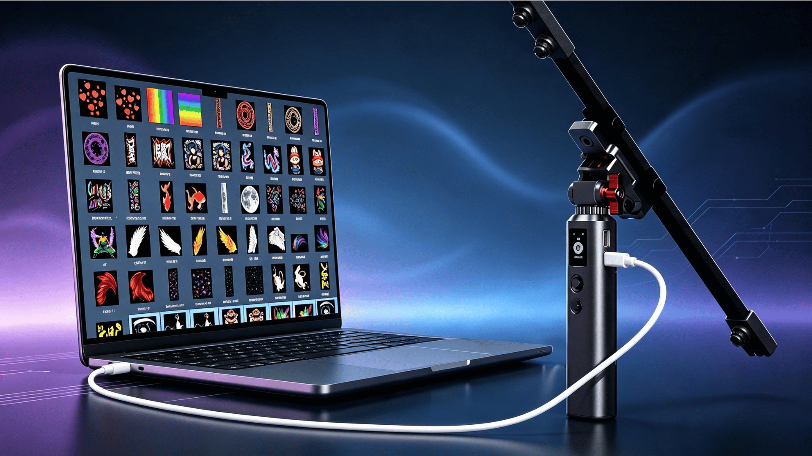

import Link from '@docusaurus/Link';

# 连接手机与电脑

独角仙S1 支持两种连接方式：**无线热点连接**（配置参数、管理素材）和**有线 U 盘连接**（读写文件、更新灯光效果）。按需选择即可。

## 无线连接

无需数据线，通过独角仙S1 自带的 Wi-Fi 热点，用手机或电脑的浏览器即可进入管理页面。

### 步骤 1：进入"热点通"

在主界面选择并进入"**热点通**"功能。

### 步骤 2：连接 Wi-Fi 热点

进入后，屏幕会显示 Wi-Fi 热点名称和密码，用手机或电脑连接该热点。

### 步骤 3：打开管理页面

连接热点后，在手机或电脑的浏览器中输入提示的地址 `192.168.4.1`，即可成功连接到独角仙S1。

### 步骤 4：管理参数与素材

页面中包含测试设置，也可对光绘棒 App 内的图片素材进行管理。在这里可以对独角仙S1 进行各种参数设置，以及添加或删除素材。

## 有线连接

使用附带的 Type-C 数据线，将独角仙S1 连接到电脑的 USB 接口，即可进行文件读写与灯光效果更新。

### 链接方式

将独角仙S1 用 Type-C 数据线连接到电脑。

### U 盘功能

连接成功后，电脑的资源管理器中会出现一个新的 U 盘盘符，可以像普通 U 盘一样读写文件。

可以直接在 U 盘中进行的操作，例如：
- 将新的灯光效果程序复制到 U 盘
- 管理图片素材
- 更新系统文件，等等

## 注意事项

### 关于数据线

- 为确保充电功率和数据传输的稳定性，推荐使用原装配套的数据线
