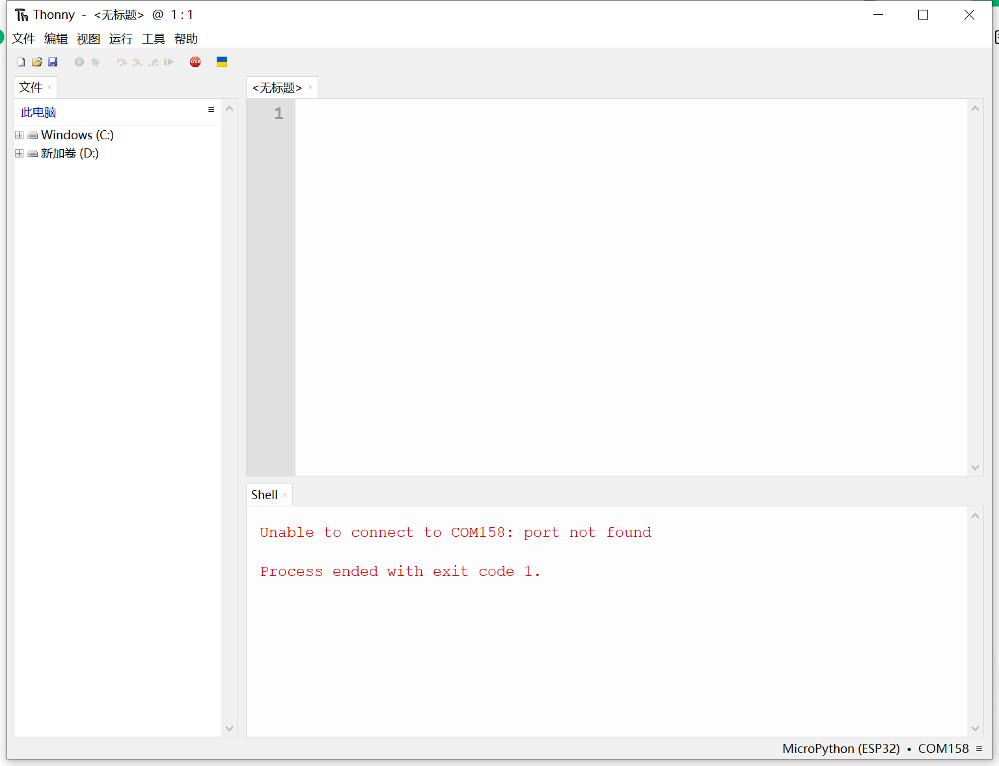

import Link from '@docusaurus/Link';

# 萤火虫T1 打包与分享灯光程序

编写完灯光程序后，可以将其打包成效果文件，方便分享给其他用户使用。

## 准备工作

在打包之前，确保你的灯光程序已经测试通过，能够在萤火虫T1 上正常运行。

## 制作效果图标

为你的灯光效果制作一个预览图标，方便其他用户在设备上识别：

图标要求：
- 格式：PNG
- 建议尺寸：64×64 像素
- 文件命名：与效果文件夹同名

## 打包效果文件

参考 demo 效果的目录结构，将你的程序和图标打包在一起：

打包步骤：
1. 在 `/apps/` 下创建你的效果文件夹
2. 将灯光程序文件放入其中
3. 添加效果图标文件
4. 更新 `config.json` 配置文件

## 在设备上运行

将打包好的效果上传到萤火虫T1，在设备上实际运行测试：

:::caution 注意
运行前请确保在 Thonny 中关闭了"运行代码前，先重启解释器"的选项，否则可能导致设备重启。
:::

## 分享到社区

完成打包后，欢迎将你的作品分享到社区，让更多人体验你的创意：

- 将效果文件压缩为 ZIP 包
- 附上效果说明和截图
- 分享到社区论坛或社交媒体

## 下一步

想了解更多编程技巧？请参考：
- <Link to="./custom-api">自定义 API 文档</Link>
- <Link to="./mpy-standard-api">MicroPython 标准 API</Link>