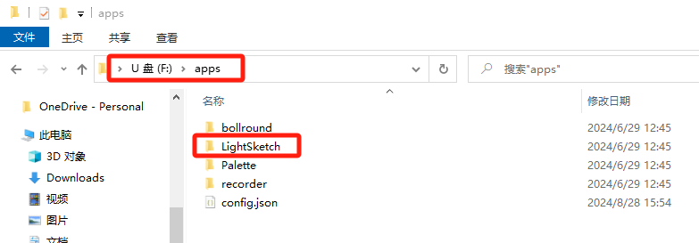
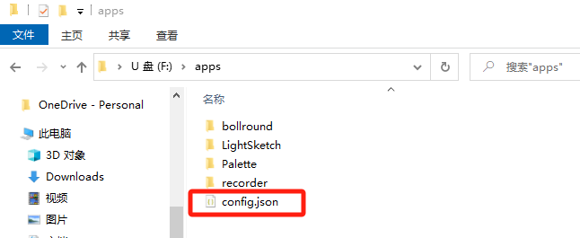

import Link from '@docusaurus/Link';

# 应用安装

官方应用库会持续更新各种最新、好玩的应用，让你不断拓展萤火虫T1的功能。适合摄影爱好者和玩家使用，无需任何编程基础，直接下载现成的应用即可上手。

## 应用一览

应用库是一个在线表格，提供各种萤火虫T1可用的灯光应用下载。请访问 [萤火虫T1 应用库](https://socolode.yuque.com/ogwgwg/xnlyru/ktn7g8bbx5d6wln6) 查看完整的应用列表和下载链接。

## 安装灯光应用

### 1. 下载应用文件

打开应用库，选择一个喜欢的灯光应用并下载。

### 2. 连接电脑

用 USB 数据线将萤火虫T1 连接到电脑。等待几秒钟，电脑上会出现一个新的 U 盘。

### 3. 添加应用

1. 把下载回来的灯光应用文件，直接放入U盘的 `/apps` 文件夹里面

### 4. 注册应用（启用应用）

1. 用电脑的文本编辑工具，打开U盘里面的 `apps/config.json` 文件

2. 在 `config.json` 文件里面，添加新的应用信息

**添加说明：**

如图，就是1个灯光应用的基本信息，需要把"新添加"的应用的基本信息按照如下格式，填进配置文件里面。

- `"name"`: 应用名称
- `"folder"`: 应用文件夹路径
- `"enabled"`: 是否启用应用

:::note 注意
- 必须填写 `config.json` 文件，才能显示应用图标以及使用应用
- 元素列表的顺序，就是应用的显示顺序
:::

### 5. 启动应用

如添加和配置成功之后，萤火虫开机，左右拨动摇杆，即可显示出新添加的应用，单击"中键"即可启动新的应用！