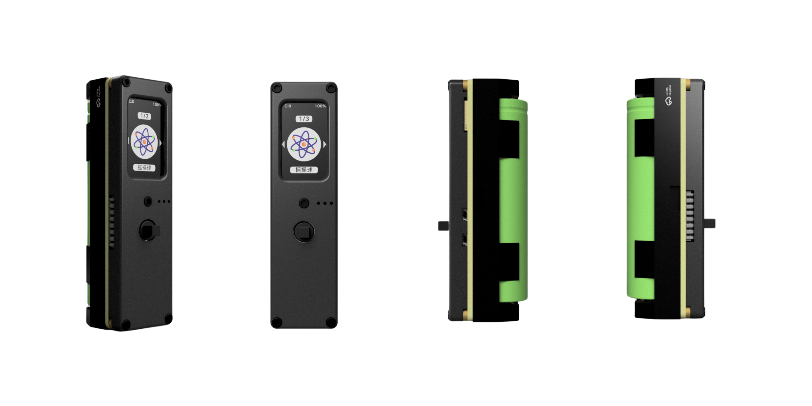

import Link from '@docusaurus/Link';

# 效果参数调整

大多数灯光效果都支持实时调整参数——亮度、速度、颜色等——无需连接电脑，用设备上的五向按键就能改。

## 进入参数调整模式

1. 在灯光效果运行状态下，单击"中键"进入效果菜单
2. 拨动"上下键"选择"参数调整"
3. 单击"中键"进入参数列表



## 可调参数

不同效果提供的参数可能不同，常见的参数包括：

| 参数 | 说明 | 调整范围 |
|------|------|----------|
| 亮度 | 整体灯光亮度 | 0-100 |
| 速度 | 动画变化速度 | 1-10 |
| 颜色 | 主色调或颜色方案 | 预设色板 |
| 饱和度 | 色彩饱和度 | 0-100 |
| 模式 | 效果的子模式切换 | 按效果定义 |

### 调整方法

1. 选中参数后，拨动"左右键"调整数值
2. 调整时效果会实时变化，方便预览
3. 确认效果后，单击"中键"保存并返回

## 通过配置文件调整

对于需要更精细控制的效果，可以直接编辑效果目录下的配置文件。

### 操作步骤

1. 用 USB 数据线连接萤火虫T1 到电脑
2. 打开 U 盘中对应效果的文件夹（`/apps/效果名称/`）
3. 用文本编辑器打开 `config.json` 或 `settings.py` 文件
4. 修改参数值后保存，安全弹出 U 盘

### 配置示例

```json
{
  "name": "我的效果",
  "brightness": 80,
  "speed": 5,
  "color": "#FF0000",
  "mode": "rainbow"
}
```

修改后重启效果即可看到变化。

## 恢复默认参数

如果调整后效果不理想，可以在效果菜单中选"恢复默认"，或直接删除配置文件后重启效果。

## 注意事项

- 部分简单效果可能不支持参数调整
- 实时调整的参数在设备重启后会被保存
- 通过配置文件修改参数时，请确保 JSON 格式正确