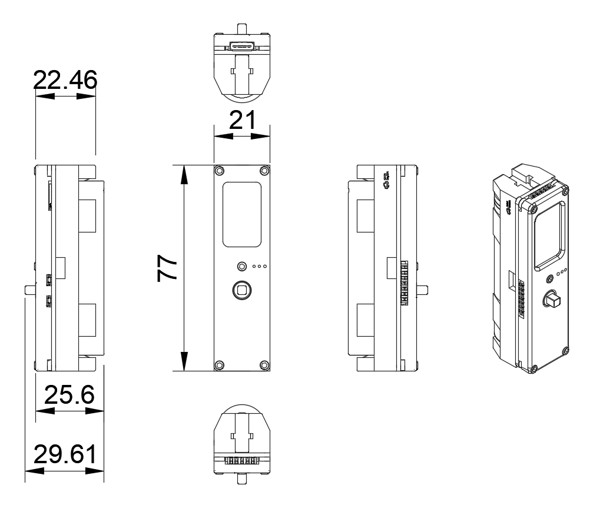
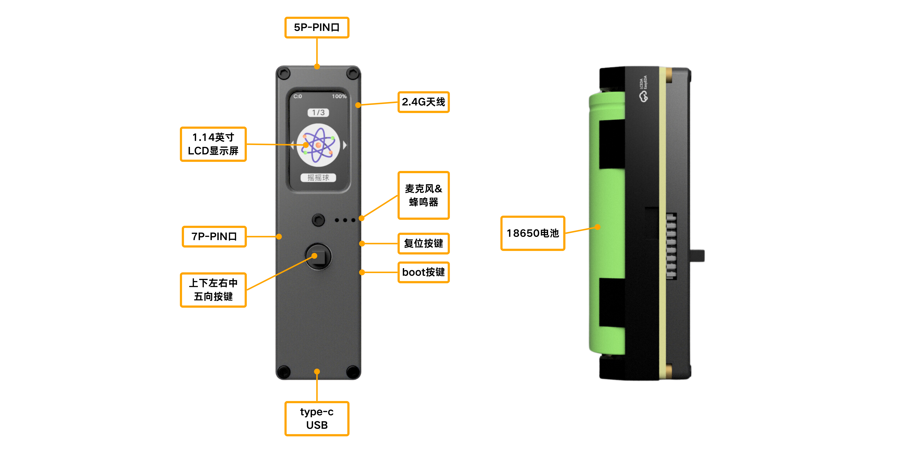

# 产品手册

## 简介

萤火虫T1是一款介于传统开发板和成品之间的产品，既可作为独立运行的设备，又可以通过搭配各种附件实现多样化的功能。既适合初学者进行学习和实验，也能满足有经验的开发者的需求。

主控芯片采用 ESP32S3，还集成了 1.14 寸 LCD、麦克风、蜂鸣器、陀螺仪和按键等外设，为用户提供了更多的选择和灵活性。产品特色之一是其高达 18W 的电源输出功率，专为低至中功率的灯光控制应用而设计。从简单的 LED 到复杂的光效，都能轻松实现。

在软件方面，萤火虫T1 预装了流行的 MicroPython 嵌入式系统，使用 Python 语言进行开发。这使得开发者无需花费过多时间在编译和调试上，只需将脚本文件拖放到 U 盘即可运行。这种简便的使用方式不仅节省了时间，也使得即使是初学者也能迅速上手，实现自己的想法。

## 产品参数

### 主控资源

| 参数 | 说明 |
|------|------|
| MCU | ESP32S3，240MHz 双核，520KB SRAM，384KB ROM，支持 Wi-Fi、蓝牙 |
| Flash 闪存 | 8MB FLASH |
| SD 卡 | 128MB SMD NAND FLASH |
| 输入电压 | 5V |
| USB 接口 | Type-C |
| 拓展接口（PIN） | 5P 迷你接口 ×2 |
| LCD 屏幕 | 1.14 英寸，135×240 彩色 TFT LCD，ST7789v2 |
| 麦克风 | SPM1423 |
| 按键 | 五向按键、复位按键、boot 按键 |
| PMU | SW6106 |
| 蜂鸣器 | 无源 SMD 蜂鸣器 |
| MPU | BMI270 & BMM150 |
| 天线 | 2.4G 3D 天线 |
| 电池 | 18650 4.2V 可更换电池 |
| 工作温度 | 0°C ~ 61°C |

## 外观介绍

萤火虫T1 采用紧凑的一体化设计，正面为显示屏，四周分布五向按键与各类接口，便于握持与操作。

## 使用方法

### 硬件示图

:::note 注意
安装 18650 电池时，注意正负极方向，装反开不了机。
:::

### 基本操作

开关机：在关机状态下，长按“五向按键”的“中键”即可开机；在开机状态下，长按“中键”即可关机。

更详细的开箱与首次使用说明，请参考[快速上手](../quick-start/unboxing-basics.mdx)章节。

## UI 界面

我们的界面设计简单明了，让您一目了然。不繁复，不混乱，只有您需要的信息和操作方式。无论您是谁，都能轻松上手，享受操作的便捷。

## 经典应用

### 光绘棒

萤火虫与灯条融合，即可变成摄影爱好者的创意利器——光绘棒！利用 LED 灯和长曝光，在夜间创造绚丽光绘效果。轻便易携，操作简单，适用于各种户外活动和创意摄影玩法！

### 时光环

萤火虫与灯环融合，打造出一个兼具美观与实用的桌面助手——时光环！拥有 60 颗炫彩 LED，能够模拟各种时钟功能、倒计时、番茄钟、提示灯等，甚至可以结合萤火虫的数字麦克风读取音频频率，成为一个桌面节奏灯。

## 联系方式

- 关于我们与联系：[帮助与社区](../../help-community/community-contact.mdx)
- 购买方式：请访问 Socolode 官网或授权渠道购买。