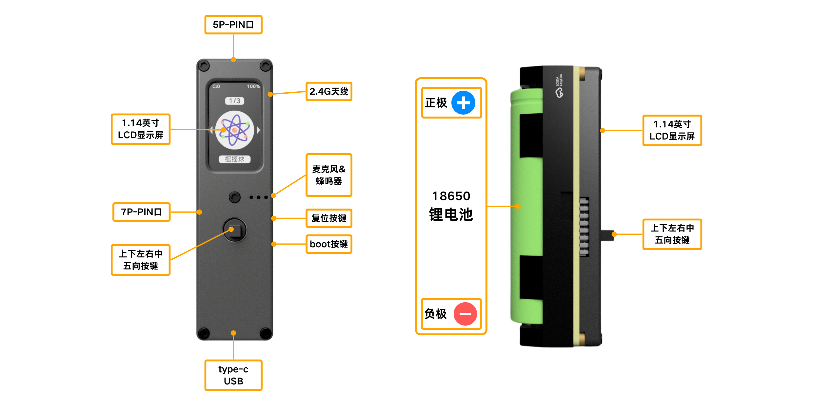
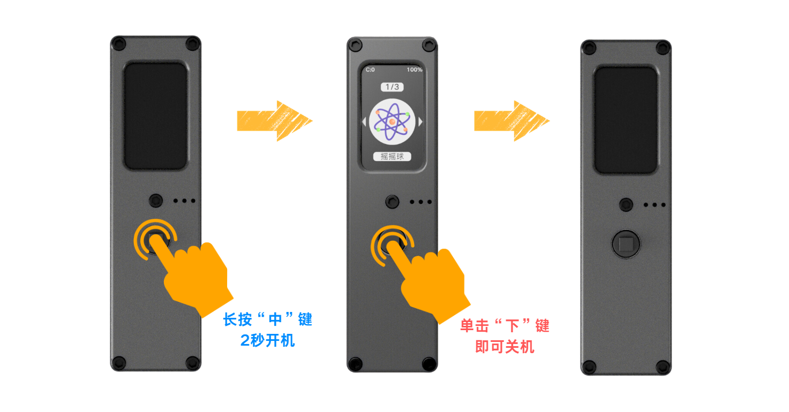
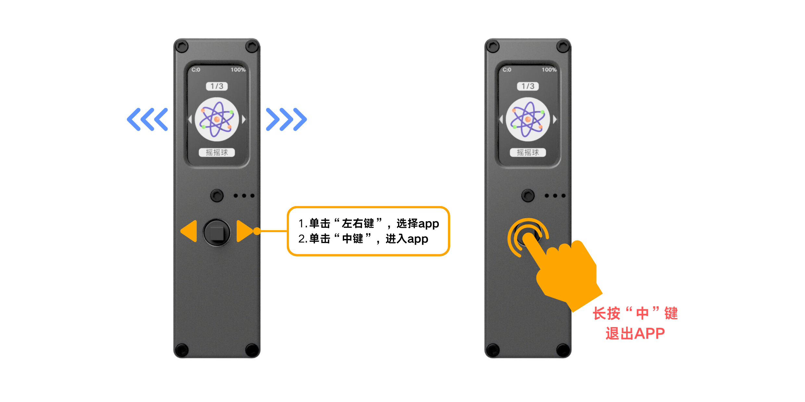
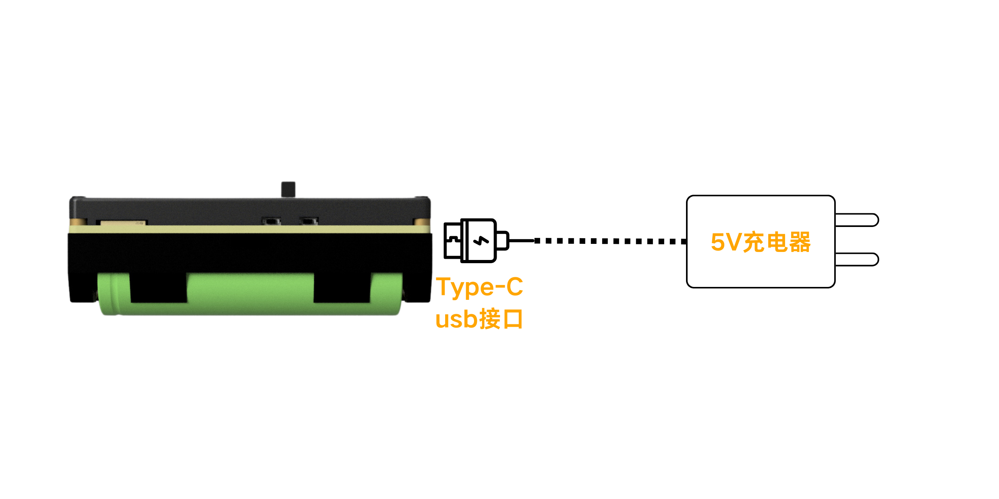
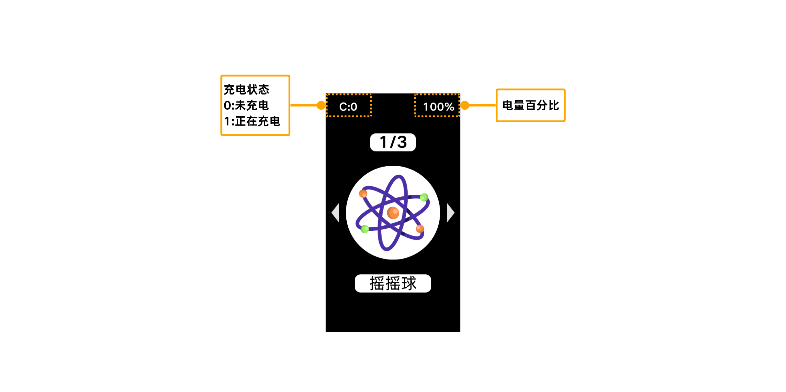

import Link from '@docusaurus/Link';

# 开箱与基本操作

## 简介

萤火虫T1是一款介于传统开发板和成品之间的产品，既可作为独立运行的设备，又可以通过搭配各种附件实现多样化的功能。本文主要是介绍作为独立运行的设备使用时，最基本操作说明。

## 硬件示图

:::caution
18650 电池安装时，注意正负极方向，装反开不了机。
:::

## 基本操作

### 开机 & 关机

**开机**
1. 关机的状态下
2. 长按“五向按键”的“中键”2秒后，即可开机

**关机**
1. 退出所有 App 回到“主页”的状态下
2. 单击“下键”，即可关机

### 进入 & 退出 App

**进入 App**
1. 拨动“左右键”，选择 App
2. 单击“中键”，进入 App

**退出 App**
1. 在 App 界面的状态下
2. 长按“五向按键”的“中键”2秒后，即可退出 App，回到“主页”

### 获取更多好玩 App

<Link to="../app-development/first-script">拓展 App 教程 →</Link>

## 充电

5V 输入，Type-C 接口，使用附带的 Type-C 数据线连接充电器或电脑即可充电。

## 电量显示

屏幕左上角显示充电状态（C:0 表示未充电，C:1 表示正在充电），右上角显示当前电量百分比。

