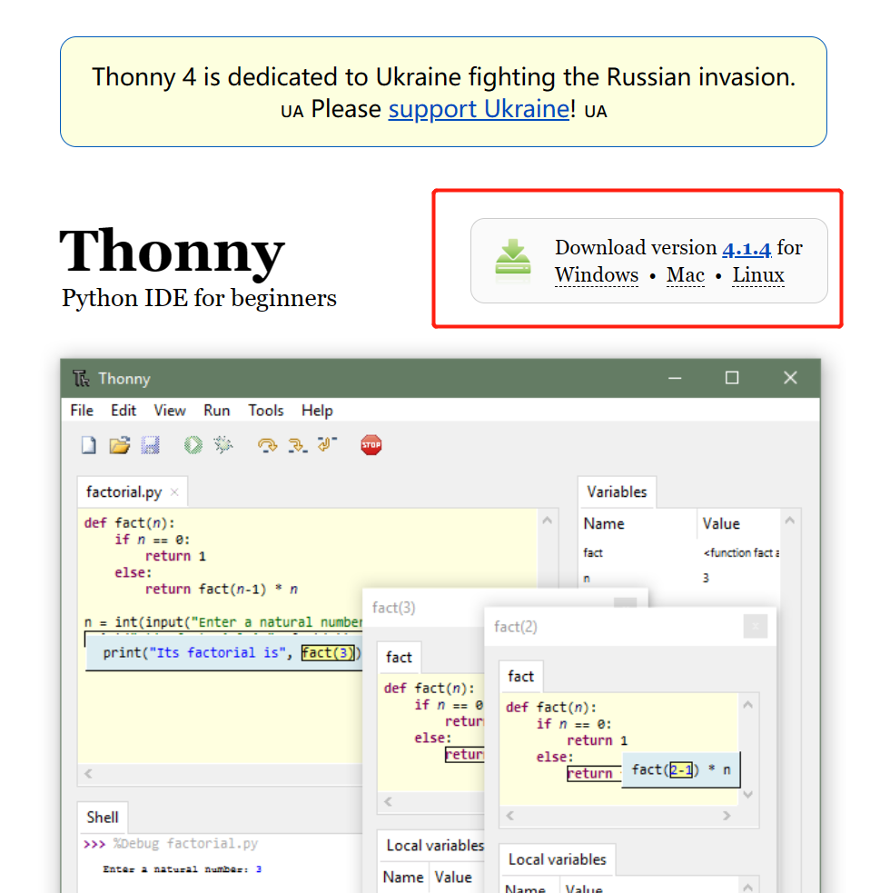
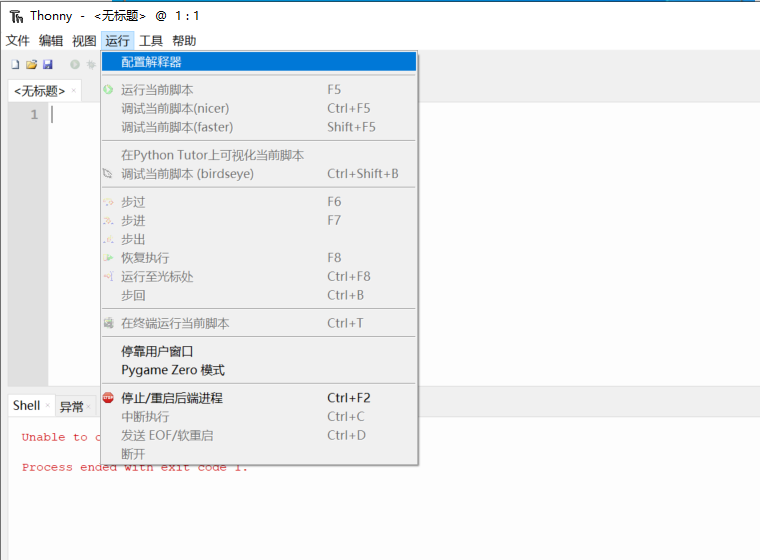

import Link from '@docusaurus/Link';

# 固件更新与系统烧录

## 如何检查固件版本

开机后，在主页界面即可看到当前固件版本号。如果遇到功能异常或想体验新功能，可以尝试更新固件。

## 固件下载

最新固件文件可通过以下链接获取：

[萤火虫T1所有固件 - 百度网盘](https://pan.baidu.com/s/19I89DSC0XkglKS-24e6vkA?pwd=j99s)

## 更新步骤

### 方法一：通过Thonny烧录固件

1. 安装Thonny编程工具
2. 下载固件
3. 刷写步骤：
   - 先关机，按住摇杆的"右方向键"
   - USB数据线连接电脑
   - 打开Thonny配置解释器
   - 点击"安装/更新MicroPython"
   - 选择固件文件和COM端口

### 方法二：通过命令行烧录

1. 打开命令行（Thonny工具 -> 打开系统Shell）
2. 输入烧录命令

:::caution 注意
如目标端口没有萤火虫T1的COM端口，可能是在USB连接电脑时没有"按住boot"的原因。
:::

## 更新建议

- 更新前请确保设备电量充足
- 如无特殊需求，建议使用最新稳定版固件
- 更新后如果遇到问题，可以刷回之前的版本