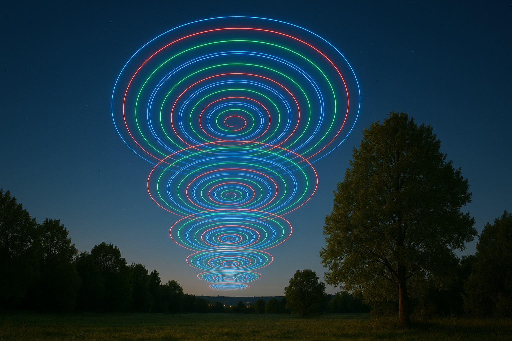
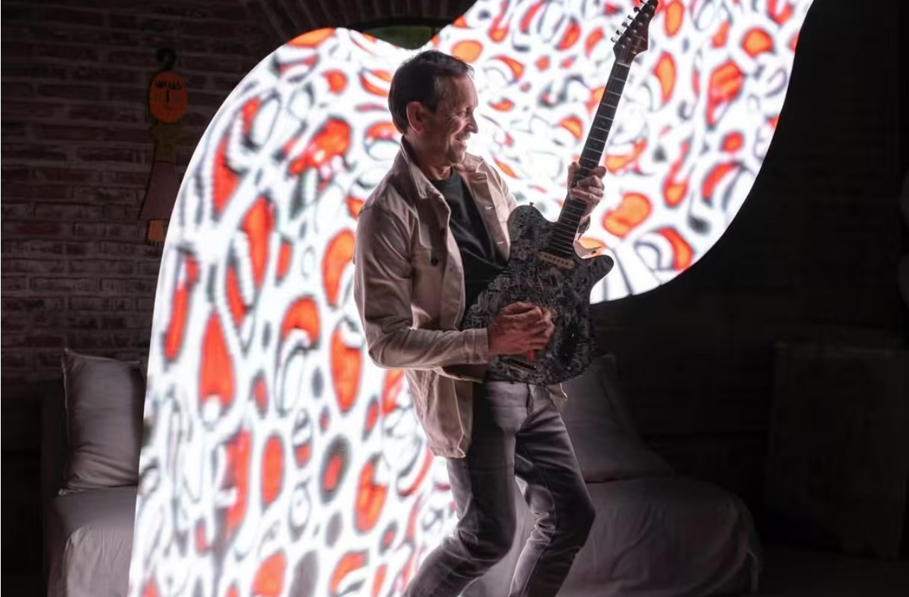

<head>
  
</head>

# 光绘玩法总汇

光绘玩法总汇是 Socolode 收集整理的光绘创意灵感与技巧库，汇集了数十种光绘创意玩法，每种玩法配有详细的拍摄参数、技巧讲解以及光绘素材，帮助你快速上手、轻松复刻效果。

## 灵感库

在这里，你可以浏览众多优秀的光绘作品，激发创作灵感（持续更新）

[查看创意灵感收集 →](./creative-inspiration.mdx)

## 教程库

每个作品库都配有详细的拍摄参数、技巧讲解以及光绘素材，帮助你快速上手、轻松复刻效果。

  
  
<strong>翅膀库</strong>

  
  
<strong>车库</strong>

  
  
<strong>红色库</strong>

  
  
<strong>景点库</strong>

  
  
<strong>魔法阵库</strong>

  
  
<strong>节日库</strong>

  
  
<strong>文字库</strong>

  
  
<strong>无人机库</strong>

  
  
<strong>画布库</strong>

:::info
如果你也有精彩的作品，欢迎联系我上传分享，让更多人看到你的创意，一起交流、共同进步！
:::

## 交流群

欢迎加入光绘交流群，与其他光绘爱好者一起交流创作心得：

