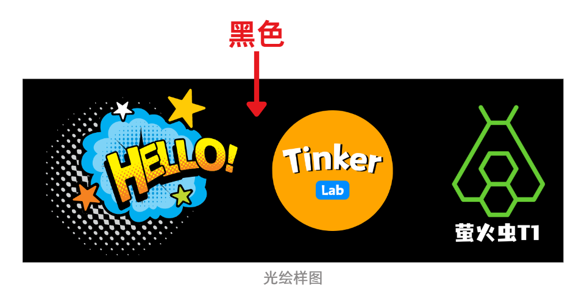
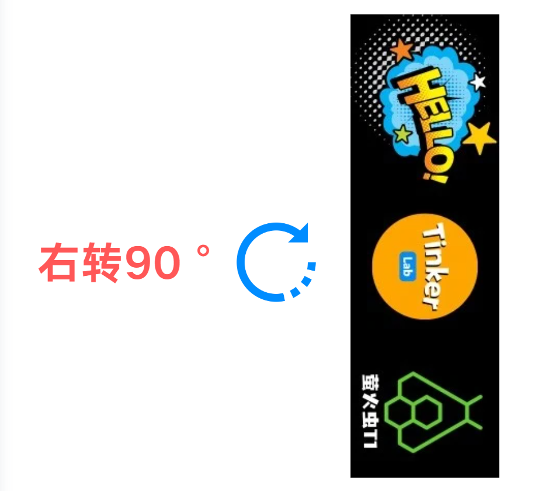
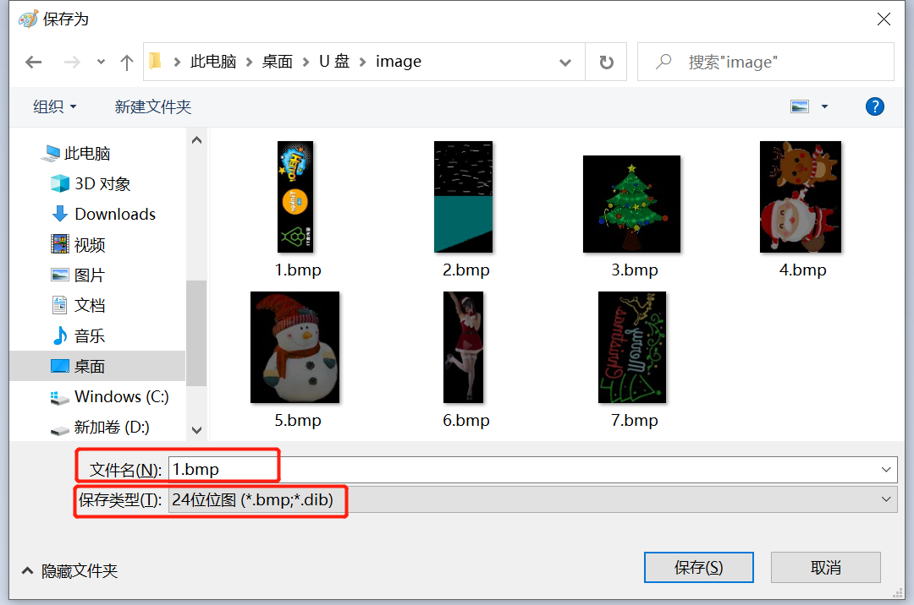
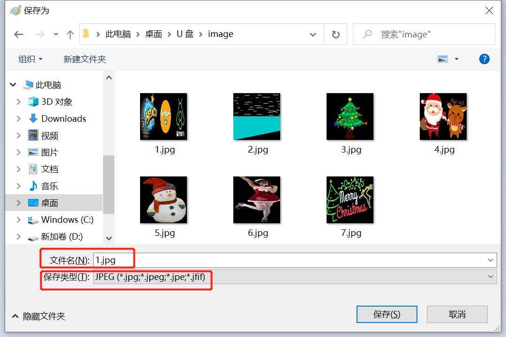

# OpenStick T1 素材制作 - 制作自己的光绘图案

## 简介

在开始制作自己的光绘图片之前，我想简要介绍一下"光绘棒播放图片的原理"，以帮助更好地理解图片制作过程。

由于萤火虫T1的性能有限，图片的细节处理需要先在电脑上进行"预处理"，然后再将其上传到萤火虫T1进行播放。

播放图片的过程是从下往上逐帧进行的。因此，在预处理图片时，需要进行旋转和翻转等操作。

---

## 新制作方法（自动）

### 在线处理工具

点击访问：[在线光绘图片处理工具](../online-tool.mdx)

[打开在线工具 →](../online-tool.mdx)

### 关键参数说明

| 参数 | 说明 |
|------|------|
| **横竖刷** | 根据您的实际绘制需求选择。适用于不同的创作场景，以达到最佳效果。 |
| **自然饱和度** | 依据个人偏好调整。数值越高，光绘色彩越鲜艳亮丽。 |
| **黑色调节** | 通过降低黑色值来净化背景，使图片中的黑色区域变为纯黑（RGB值为0,0,0）。可以通过将鼠标悬停在图片的黑色背景上并检查"当前像素RGB值"是否为(0,0,0)来验证这一点。 |
| **白色调节** | 提高白色值可以让整体画面更加明亮，从而让光绘线条更加清晰可见。 |
| **输出像素** | 此设置与使用的灯棒长度相关联。例如：1米3拼接的灯棒选144；1.65米5段拼接灯棒选240；1段灯棒48灯，其他以此类推。 |

---

## 旧制作方法（手动）

### 1. 制作光绘图片

#### 1.1 图片尺寸

因为光绘棒的灯珠是144颗，所以图片的像素要求是：**144 × N**（高：固定144，宽：无限）。

#### 1.2 图片调整

##### 黑色背景

灯珠是通过"不发光"来显示"黑色"的，所以不需要显示的地方要设为黑色，例如背景。

##### 调色

因为光绘拍出来的色彩效果，一般都会比显示屏显示的要"淡"，所以需要预先把图片的"饱和度"调高，才能让拍出来的光绘色彩更还原图片素材的色彩。

##### 右90度翻转

目前光绘棒的程序设置的图片播放顺序是：从下往上，逐帧播放。所以图片需要做一个右90度旋转的操作。

##### 镜像图片

因为光绘拍摄出来的照片都是"镜像"的照片，所以想要光绘的图片字体是正常的，需要把图片进行一个垂直翻转！

#### 1.3 图片格式

导出配置，必须按照要求导出，不然播放不了：

- **名字要求**：数字或者字符（不支持中文）
- **保存类型**：24位位图（*.bmp）

#### 1.4 预览图片

为了方便在光绘棒APP上选择图片时，能看到图片预览，我们需要给图片做一个像素（分辨率）为100×100的缩放小图！

导出配置：
- **名字**：与主图命名一样
- **像素**：100×100
- **格式**：*.jpg

至此，我们得到了两张图片：

| 主图 | 预览图 |
|------|--------|
| xxx.bmp (144×N) | xxx.jpg (100×100) |

---

## 上传光绘图片

主图和预览图做好之后，需要上传到萤火虫T1的SD卡指定位置：`/sd/image`，才可以播放图片。

---

## PS 操作视频

本视频的PS版本是在线版PS，可能跟最新的桌面版PS操作界面有所区别，但操作逻辑是一样的。

PS网站：[https://ps.pic.net/](https://ps.pic.net/)

### 3.1 预处理

在制作光绘图片文件之前，可以对原图进行一个基本的"预处理"：

- **净化背景**（防止光绘出来的图片背景发白）
- **提高饱和度**（让光绘色彩效果更鲜艳明亮）

:::note
PS 预处理操作视频占位（待补充）
:::

### 3.2 导出光绘棒素材文件

把预处理过的图片，进行像素调节、方向旋转等处理，从而导出光绘棒能识别使用的图片文件。

:::note
PS 导出操作视频占位（待补充）
:::

---

## 注意事项

- 图片名字**不支持中文**
- jpg的像素（分辨率）必须为 **100×100**

---

## 常见问题

### 导入图片之后，显示"jpg error"

说明预览图格式不对，需要把导出的"attach metadata（附加元数据）"勾上。

再不行，可以直接通过系统自带的"画画"工具，进行另存为jpg格式即可。

---

## 最终效果图

---

## 联系支持

有什么问题都可以随时联系我哦~

**个人微信**：agui-lab

<head>
  
</head>
