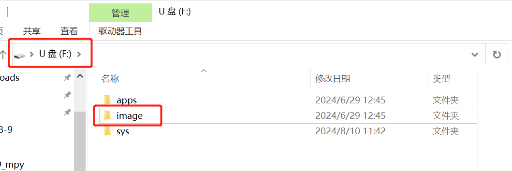

import Link from '@docusaurus/Link';

# 素材下载

完成素材制作后，需要将图片导入到光绘棒设备中才能使用。本教程介绍如何通过 USB 连接电脑，将素材图片上传到萤火虫 T1。

---

## 1. 连接电脑

通过 USB 数据线，连接萤火虫 T1 到电脑上，等待电脑加载出新的 U 盘。

**连接方式：**

**电脑识别到的 U 盘：**

---

## 2. 导入素材图片

### 1️⃣ 打开 image 文件夹

打开 U 盘，进入 `image` 文件夹（如果没有该文件夹，可手动创建）。

### 2️⃣ 复制素材图片

将制作好的**主图（BMP）**和**预览图（JPG）**复制到 `image` 文件夹中，即可完成上传。

:::tip 文件命名
建议将素材文件重命名为数字或英文（如 `001.bmp`、`001.jpg`），避免使用中文文件名导致设备无法识别。
:::

---

## 3. 导入完成播放素材

完成了图片上传之后，在萤火虫 T1 上打开光绘棒 App，即可选择刚才导入的图片进行光绘创作！🎉

:::note 素材制作
如果还没有制作素材，请先参考 <Link to="./material-creation" style={{color: '#2563eb', textDecoration: 'underline'}}>素材制作</Link> 教程，学习如何使用在线工具或 PS 制作光绘图片。
:::

<head>
  
</head>
